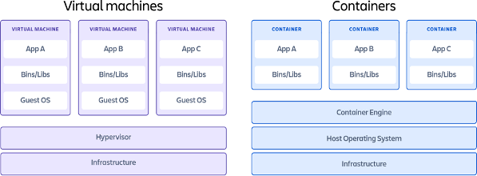
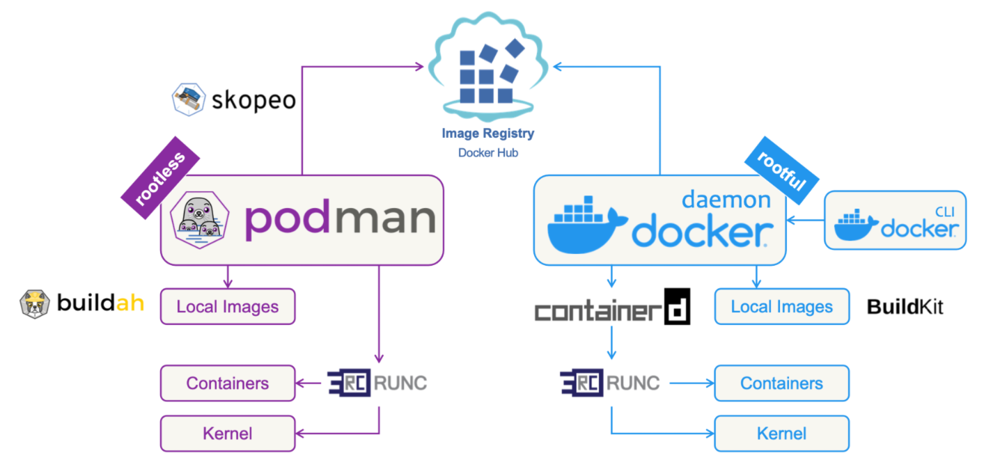

# PB177 – Introduction to Podman, reconnaissance

## Table of Contents

- [Learning objectives](#learning-objectives)
- [Sandbox building blocks – containers](#sandbox-building-blocks--containers)
- [Start the sandbox](#start-the-sandbox)
  - [Notes](#notes)
- [Nmap](#nmap)
  - [Task: Scanning IP Blocks](#task-scanning-ip-blocks)
  - [Task: Scanning for running software and version numbers](#task-scanning-for-running-software-and-version-numbers)
  - [Task: Gather Victim Network Information: DNS](#task-gather-victim-network-information-dns)
  - [Task: Gather Victim Org Information](#task-gather-victim-org-information)
  - [Task: Wordlist Scanning](#task-wordlist-scanning)
- [dirb](#dirb)
  - [Task: Wordlist Scanning](#task-wordlist-scanning-1)
- [Generative AI](#generative-ai)
  - [Task: Phishing for Information](#task-phishing-for-information)
- [Web browser](#web-browser)
  - [Task: Search Open Technical Databases: WHOIS](#task-search-open-technical-databases-whois)
  - [Task: Search Victim-Owned Websites](#task-search-victim-owned-websites)
- [End of the lab](#end-of-the-lab)

## Learning objectives

At the end of this lab session, you will be able to:
- set up a virtual network environment (sandbox) at a computer in a lab (nymfe), 
- access the sandbox and its services via CLI a GUI from your host machine, 
- troubleshoot the sandbox and services,
- use `nmap`, `dirb`, generative AI, and web browser for reconnaissance tasks.

<details open>
<summary>What is reconnaissance?</summary> 

Techniques that involve adversaries actively or passively gathering information that can be used to support targeting.\
See [MITRE ATT&CK® Matrix for Enterprise](https://attack.mitre.org/versions/v15/tactics/TA0043/) for more info.

</details>

## Sandbox building blocks – containers



* Containers – lightweight software packages containing all the dependencies required to execute the contained software applications.
* Virtual machines (VMs) – heavy software packages providing complete emulation of low-level hardware devices like CPU, disk and networking devices. 

In this lab sessions, we will use containers orchestrated by Podman.\
If you're familar with Docker, you might be interested in <details open><summary>differences between Podman and Docker.</summary>

</details>

Podman is already installed at PCs in A219 and in PC hall. If you're not familiar with Podman, learn
<details open>
<summary>
essential commands.
</summary>

* List all running containers: `podman ps`
* List containers forming an application (or sandbox in our case):
  1. Go to a directory with a Compose file
  2. Run `podman-compose ps` there
* Start the application (sandbox): `podman-compose up -d`
* Stop the application (sandbox): `podman-compose down`
* Stop the application (sandbox) and remove volumes (disks): `podman-compose down -v`

</details>

## Start the sandbox

* Log in and open Terminal.
* Clone this repository containing the sandbox (virtual environment):
```git clone https://gitlab.fi.muni.cz/cybersec/pb177/labs.git```
* Follow the following steps to setup the sandbox:
  1. Change directory to `labs/1`.
  1. Login to get access to Podman images: `podman login gitlab.fi.muni.cz:5050`.
  1. Run `podman-compose up -d`. Note: there is a hyphen between do not run `podman` and `compose`, not whitespace. `podman compose` does not work at PCs at FI by default. However, you can [change the default configuration](podman_compose_wrapper.md).
  1. Wait for downloading images and starting the environment.
  1. Check whether all containers are up and running: `podman-compose ps -q | wc -l`.\
  You should see number `8` at the last line of the output.
* Check you can access Kali container using terminal and RDP:
  1. Run `podman-compose exec attacker bash` to get root shell of `attacker` machine.
  2. Use Remmina RDP client (installed at nymfe) to connect as user `kali` via remote desktop running at `localhost` at port `14000` (fourteen thousand). You can use the [`attacker-rdp.remmina`](./1/attacker-rdp.remmina) configuration file. At nymfe, run `open ./attacker-rdp.remmina` in the directory with the sandbox to launch the client directly. You will need to enter only password `kali`. You may want to increase screen resolution using a button on the Remmina toolbar on the left.
  3. Now you can close the `RDP` session, as we won't be needing it today (but we wanted to show you how it works as the following seminars will require its usage).  

### Notes

* Podman 4.9.3 and `podman-compose` 1.0.6 is installed at PCs at FI (latest versions in Ubuntu 24.04 LTS). This is the *only* HW and SW configuration we guarantee the sandbox works.
* If you run the sandbox at your own PC and install the latest version of Podman, replace `podman-compose` commands with `podman compose` (whitespace instead of a hyphen).
* If you run the sandbox at your own PC and prefer Docker, it *might* work at your setup. Replace `podman` with `docker` in all commands (including `podman login`).

## Nmap

[Nmap](https://nmap.org/) ("Network Mapper") is a free and open source utility for network discovery and security auditing.

### Task: Scanning IP Blocks

[T1595.001](https://attack.mitre.org/techniques/T1595/001/), also [T1590.005](https://attack.mitre.org/techniques/T1590/005/).

Two organization you would like to attack have been assigned IP ranges `10.0.33.0/24` and `10.0.66.0/24`.

Find IP addresses of hosts that are up.

<details open>
<summary>
Solution and follow-up tasks
</summary>

```
nmap 10.0.33.0/24 10.0.66.0/24
```

* More targets can be specified. Use whitespace as a separator.
* Control scanning speed (timing) by `-T` option (from 0 to 5). 
  * Higher value is faster, the default is `-T3`. 
  * Run again the scan with `-T5` and see the difference. It may look negligible but it helps when scanning large IP blocks or the entire port range.
  * When you would use lower `-T` values (speed)?
* Run again the scan and use other output formats. Can be useful for futher processing.
  * Default output to stdout and grepable output to a file: `nmap 10.0.33.0/24 10.0.66.0/24 -oG output.txt`. 
  * Grepable output to stdout: `nmap 10.0.33.0/24 10.0.66.0/24 -oG -`.
* Increase the verbosity level by adding `-v`.
* What have you just done? Horizontal or vertical scanning?

</details>
</br>

> **A general note**: when trying to find the right combination of switches and tweaking parameters, it is more time-efficient to target a specific host instead of whole network(s).


### Task: Scanning for running software and version numbers

#### Services

[T1595.002](https://attack.mitre.org/techniques/T1595/002/), also [T1592.002](https://attack.mitre.org/techniques/T1592/002/)

Find running services and their software versions at the hosts which are up.

<details open>
<summary>
Solution and follow-up tasks
</summary>

```
nmap 10.0.33.0/24 10.0.66.0/24 -p- -sV -sS -sU -Pn
```

* nmap scans 1000 most common ports By default. Use `-p` to specify the port range. `-p-` scans all ports (equals to `-p 1-65535`).
* Use `-sV` to determine service and version info. Useful when a service runs at non-standard port. Compare result of the scan with and without `-sV` (they differ).
* Scan UDP ports too. 
  * There is one service running at UDP you might miss. However, UDP scanning is slow compared to TCP. `-T4` or `-T5` can help.
  * Hint: scan only `10.0.66.150` for 100 most common ports: `nmap 10.0.66.150 -F -sV -sU`. 
  * Hit Enter key when scanning is in progress. You will see its status. Alternatively, use `-v` option.
* For more infor about available scan techniques, see [nmap documentation](https://nmap.org/book/port-scanning-options.html#port-scanning-options-scantypes).
* Once you have discovered hosts, you can disable host discovery by adding `-Pn`.

</details>

#### Operating systems

What operating systems are runnning at hosts you have discovered?

<details open>
<summary>
Solution and follow-up tasks
</summary>

```
nmap 10.0.33.0/24 10.0.66.0/24 -p- -O
```

* `-p-` is key here. nmap need at least 1 open and 1 closed port for a succesfull OS detection. Run the command without `-p-` and see the difference for hosts running one service at a non-standard port that is not scanned by nmap by default.
* Once attackers gather software versions, they may search for vulnerabilities affecting a particular operating system and application version. The option `--script=vuln` further aids attackers.

</details>

### Task: Gather Victim Network Information: DNS

[T1590.002](https://attack.mitre.org/techniques/T1590/002/)

Resolve hostnames of IPs discovered by `nmap`.
What can you infer from them?

<details open>
<summary>
Solution
</summary>

```
host 10.0.33.50
```

Domain names may reveal other useful information, such as the role or fuction of the host in the organization.\

</details>

### Task: Gather Victim Org Information

[T1591](https://attack.mitre.org/techniques/T1591/)

Find out additional information about the second organization in a certifiate of its HTTPS server.

<details open>
<summary>
Solution and follow-up tasks
</summary>

```
nmap -sC web.org2
```

* nmap comes with a set of useful scripts. All default scripts can be executed by `-sC` option.
* A concrete script is executed by `--script ssl-cert`.
* Compare the output of these two execution. They differ in a level of detail.
* To enable OS and version detection, script scanning, and traceroute, use `-A`, such as `nmap -A web.org2`.

</details>

### Task: Wordlist Scanning

[T1595.003](https://attack.mitre.org/techniques/T1595/003/)

Discover (enumerate) publicly accessible directories at web servers.

<details open>
<summary>
Solution and follow-up tasks
</summary>

```
nmap --script=http-enum web.org1 web.org2
```

* What are the names of the discovered directories?
* What do they contain?
* Inspect how the [http-enum script](https://github.com/nmap/nmap/blob/master/scripts/http-enum.nse) works.

</details>

## dirb

[dirb](https://dirb.sourceforge.net/about.html) is a web content scanner.

### Task: Wordlist Scanning

[T1595.003](https://attack.mitre.org/techniques/T1595/003/)

Discover publicly accessible directories at web servers using `dirb` and compare its capabilities and output to `nmap`.

<details open>
<summary>
Solution and follow-up tasks
</summary>

```
dirb https://web.org2
```

* Inspect the wordlist used by `dirb` at `attacker`. The location of the wordlist is shown by dirb.
* How many entries does the wordlist contain?
* What is the difference between `http-enum` and `dirb`?

</details>

</br>

> **Limitations of these tools**: `nmap` and `dirb` can be quite intrusive while doing their scanning. Therefore in some cases they can not be used, such as:
> * The target network is composed of fragile devices (IoT for example), that might break even on the simplest scans.
> * Stealth is an operational priority: network and wordlist scans are quite noisy in network traffic and logs. In the case an attacker must stay hidden, their use is counter effective.
>  


## Generative AI


### Task: Phishing for Information

[T1598](https://attack.mitre.org/techniques/T1598/)

Use your favourite AI tool to generate a text of a phishing mail for employees of the university study department.\
The ultimate goal is to get their credentials for accessing the study information system.

## Web browser

Use your favourite browser to gain useful information from public databases or websites.

### Task: Search Open Technical Databases: WHOIS

[T1596.002](https://attack.mitre.org/techniques/T1596/002/)

Use Whois to find out a possible target of a spearphishing mail at Masaryk University.

<details open>
<summary>
Solution and follow-up tasks
</summary>

Command-line interface: `whois muni.cz`\
Web interface of Whois for CZ domain: https://www.nic.cz/whois/

Note: When using CLI, the Whois server may reply `Your connection limit exceeded. Please slow down and try again later.` even after the first request.

* What is the name of the administrative contact?
* Can you find an email of the contact at the internet?

</details>

### Task: Search Victim-Owned Websites

[T1594](https://attack.mitre.org/techniques/T1594/)

Search [faculty website](https://www.fi.muni.cz) for potentialy interesting target servers.

<details open>
<summary>
Solution and follow-up tasks
</summary>

<br/>

[aisa](https://www.fi.muni.cz/tech/unix/aisa.html), [anxur](https://www.fi.muni.cz/tech/unix/anxur.html.cs), [ares](https://www.fi.muni.cz/tech/unix/ares.html), [aura](https://www.fi.muni.cz/tech/unix/aura.html) etc. at in [Unix section of Technical information](https://www.fi.muni.cz/tech/)

* The names and description of services are publicly available and allow attackers speed up the reconnaissance.
* Search for username patterns useful when creating an dictionary for authentication attack.

<details open>
<summary>
Solution
</summary>

 https://www.fi.muni.cz/tech/account.html

</details>

</details>


## End of the lab

If you finish all tasks, stop the sandbox using `podman-compose down`.